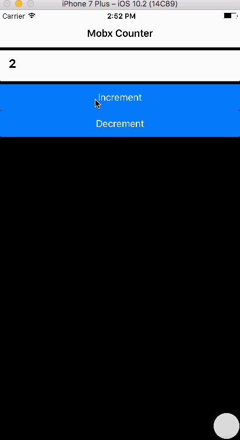
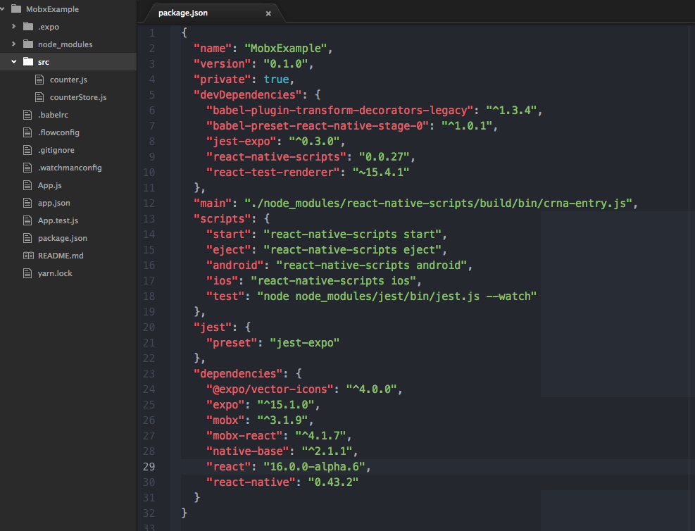

# Mobx Counter Example
This is a simple example Counter App made with [Mobx](https://github.com/mobxjs/mobx), [NativeBase](https://nativebase.io/) and [Create React Native App](https://github.com/react-community/create-react-native-app) tool. Detailed Setup instructions can be found below. <br />
**Find Full Code [here](https://github.com/GeekyAnts/native-base-example-mobx-counter)** <br />
 <br />

## Aim
We aim to create a simple App that has a counter with increment and decrement functionality. The logic is implemented in [Mobx](https://github.com/mobxjs/mobx). <br />

## Installation

1. **Create React Native App**: Use [CRNA](https://github.com/react-community/create-react-native-app) tool to create an App like this <br />
<code>
$ npm install -g create-react-native-app
</code> <br />
<code>
$ create-react-native-app my-app
</code> <br />
<code>
$ cd my-app/
</code> <br />
<code>
$ npm start
</code> <br />

2. **Install Mobx**: <br />
<code>
npm i mobx mobx-react --save
</code><br />

3. **Install babel plugins**: <br />
<code>
npm i babel-plugin-transform-decorators-legacy babel-preset-react-native-stage-0 --save-dev
</code><br />
4. Now, let’s create a .babelrc file to configure our babel plugins: <br />
```
{
 'presets': ['react-native'],
 'plugins': ['transform-decorators-legacy']
}
```
5. **NativeBase** <br />
<code>
npm install native-base --save
</code> <br />
**Important: additional steps are required to import fonts from native base. Refer to [this](./GetStarted.md#Setup_with_CRNA)**
**Configure all dependencies by running the following command** <br />
<code>
react-native link
</code> <br />

## Setting Things Up

With all required Libraries installed, we can start with some real coding. In the root of your project create a folder <code>src</code>. Inside this folder we create two files, <code>counterStore.js</code>(The Mobx Store) and <code>counter.js</code>(Counter Component). <br />
By the end of all this your project structure and <code>package.json</code> file should look something like this. <br />
 <br />

## Mobx Store Setup

We need to create a Mobx store as follows. <br />
**Code src/counterStore.js** <br />
<pre class="line-numbers"><code class="language-jsx">import {observable} from 'mobx';
class CounterStore {
  @observable counter = 0;
  increment() { this.counter++;
  console.log("increment", this.counter); }
  decrement() { this.counter--;
  console.log("decrement", this.counter); }
}
export default new CounterStore();
</code></pre><br />

**Explained**: <br />
1. We import <code>observable</code> from <code>mobs</code>. Inside our Store class we create an observable sore variable <code>counter</code>.
2. We create two methods <code>increment()</code> and <code>decrement()</code> that will be called from out component to update the store.
3. Lastly, we export a new object of our <code>store</code> class.

## Mobx Component
We create a <code>counter</code> Component and import it in our main App file.<br />
**Code src/conter.js** <br />
<pre class="line-numbers"><code class="language-jsx">import React, { Component } from 'react';
import Expo from 'expo';
import { Container, Content, Text, Card, Header, Body, Button, Title, CardItem } from 'native-base';
import CounterStore from './counterStore.js';
import {observer} from 'mobx-react';
import {View} from 'react-native';
@observer
export default class Counter extends Component{
  constructor(){
    super();
    this.state={
      isReady: false
    }
  }
  async componentWillMount() {
      await Expo.Font.loadAsync({
        'Roboto': require('native-base/Fonts/Roboto.ttf'),
        'Roboto_medium': require('native-base/Fonts/Roboto_medium.ttf'),
      });
      this.setState({isReady: true});
    }
  render(){
    if (!this.state.isReady) {
      return <Expo.AppLoading />;
    }
    return(
      &lt;Container>
                &lt;Header>
                    &lt;Body>
                        &lt;Title>Mobx Counter&lt;/Title>
                    &lt;/Body>
                &lt;/Header>
                &lt;Card>
                &lt;CardItem>
                            &lt;Text>
                                {CounterStore.counter}
                            &lt;/Text>
                &lt;/CardItem>
                &lt;/Card>
                        &lt;Button primary block onPress= {() => CounterStore.increment()}>
                             &lt;Text>Increment&lt;/Text>
                         &lt;/Button>
                         &lt;Button primary block onPress= {() => CounterStore.decrement()}>
                              &lt;Text>Decrement&lt;/Text>
                          &lt;/Button>
                          &lt;View>
                          &lt;/View>
            &lt;/Container>
    );
  }
}
</code></pre><br />

**Explained** <br />

1. We import <code>observer</code> from <code>mobx-react</code> and make our Class <code>observer</code> by pre-fixing @observer. <br />
2. <code>async componentWillMount()</code> method is used to load fonts as described [here](./GetStarted.md#Setup_with_CRNA). <br />
3. <code>state.isReady</code> is used to find out if fonts are loaded. In the meanwhile,we display <code>Expo.AppLoading</code> screen. <br />
4. We import our <code>counterStore</code> and display the observable store value <code>counter</code> in a <code>Card</code>. Buttons will fire respective functions from the Store Class.

## Finishing Up

Lastly we import our counter component in our <code>App.js</code> file. <br />
Build project and run.
