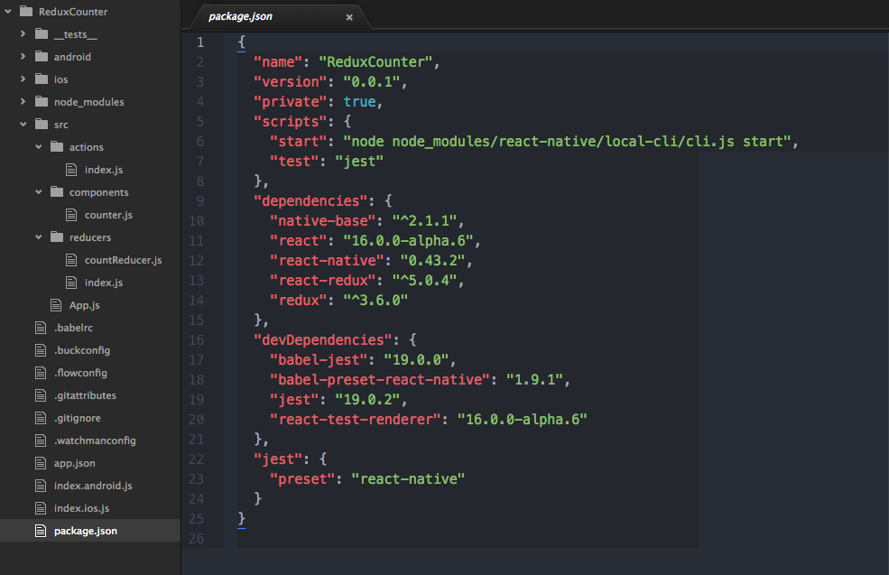

# Basic Redux Counter Example
This is a simple single page application that uses [Redux](https://github.com/reactjs/react-redux) and [NativeBase](https://nativebase.io/) as the main Libraries.  
 
  

## Aim

We aim to create a simple App that has a counter with increment and decrement functionality. The logic is implemented in [Redux](https://github.com/reactjs/react-redux).  
## Installation

**Note:  
If you encounter an issue with [React Native Router Flux](https://github.com/aksonov/react-native-router-flux) during building your project, it might be due to issue with latest versions of [React Native](https://github.com/facebook/react-native). Check out [this issue](https://github.com/aksonov/react-native-router-flux/issues/1761). You might have to bump down the versions of [React Native](https://github.com/facebook/react-native) and React**  

1. **SetUp React Native Project**   SetUp a React Native project. Refer [this](https://facebook.github.io/react-native/docs/getting-started.html) for more information about setting up a React Native project.  
2. **Installing Libraries**   With a React Native project SetUp, We can now install all required Libraries as follows.  
a. **Redux** and **react-redux**  
In your terminal enter the following  
<code>
npm install redux react-redux --save
</code>  
b. **NativeBase**  
<code>
npm install native-base --save
</code>  
**Configure all dependencies by running the following command**  
<code>
react-native link
</code>  
By the end of Installation, your package.json file should look something like this. 
  
## Setting Things Up

With all required Libraries installed, we can start with some real coding. In the root of your project create a folder <code>src</code>. Inside this folder we create three folders namely <code>reducers, actions, components</code> and one file <code>App.js</code>.  

### Redux Store Setup
We need to create our store inside our <code>App.js</code> file. If you are unfamiliar with basic Redux concepts, refer [this Documentation](http://redux.js.org/).  
**App.js Code**  
<pre class="line-numbers"><code class="language-jsx">import React, { Component } from 'react';
import allReducers from './reducers/index.js';
import {createStore} from 'redux';
import {Provider} from 'react-redux';
import Counter from './components/counter.js';
const store = createStore(allReducers);
export default class App extends Component{
  render(){
    return(
      &lt;Provider store= {store}>
     &lt;Counter />
     &lt;/Provider>
    );
  }
}</code></pre> 
Here  
1. We are optimistic here while importing <code>allReducers</code> from <code>reducers</code> folder.  
2. <code>createStore</code> function takes in our <code>allReducers</code> object and creates our Store.  
3. <code>Provider</code> component makes the store available throughout our App.  

### Redux Reducers Setup
Reducers will return the data needed by our app. Here we simply need a reducer to return the <code>Counter</code> value.  
Create a file <code>countReducer.js</code> inside <code>reducers</code> folder.  
**Code reducers/countReducer.js**  
<pre class="line-numbers"><code class="language-jsx">let count= 0;
export default function(state=count, action){
  switch (action.type) {
    case "Increment": count++;
      break;
      case "Decrement": count--;
      break;
  }
  return count;
}</code></pre> 
The reducer defined above will return the always return count value. <code>Increment</code> and <code>Decrement</code> action types will manipulate the count value as shown. 
We combine all reducers inside <code>index.js</code> file inside <code>reducers</code> function.  
**Code reducers/index.js**  
<pre class="line-numbers"><code class="language-jsx">import {combineReducers} from 'redux';
import countReducer from './countReducer.js';
const allReducers= combineReducers({
  count: countReducer,
});
export default allReducers;</code></pre> 

### Redux Actions Setup
We will simply create two actions <code>Increment</code> and <code>Decrement</code>.  
**Code actions/index.js**  
<pre class="line-numbers"><code class="language-jsx">export function increment(){
  return{
    type: "Increment"
  };
}
export function decrement(){
  return{
    type: "Decrement"
  };
}</code></pre> 

### Redux Component Setup
We just need one component here. A counter component.
### Important stuff  
In order to be able to use Reducers and actions, we need to use two important functions. Both these functions have extremely simple applications(although the names sound scary enough). 
1. <code>mapStateToProps</code> => This function, simply takes your reducer data, that is required, and converts it into a usable [Prop](https://facebook.github.io/react-native/docs/props.html). Now we can use the data as a prop. example <code>this.props.data</code>.  

 **General Syntax of mapStateToProps**  

 <pre class="line-numbers"><code class="language-jsx"><code class="language-jsx">
 function mapStateToProps(state){
  return{
    dataObj : state.reducerName
  };
}
 </code></pre> 

  **Remember how we allotted names to Reducers in the <code>combineReducers</code> function. We use the same name to call respective Reducer**

 2. <code>matchDispatchToProps</code> => This function simply converts our [Actions](http://redux.js.org/docs/basics/Actions.html) into usable props.  
 **General Syntax of matchDispatchToProps**  

 <pre class="line-numbers"><code class="language-jsx"><code class="language-jsx">
 function matchDispatchToProps(dispatch){
  return bindActionCreators({action1: importedAction1, action2: importedAction2}, dispatch)
}
 </code></pre> 
**bindActionCreators function here simply combines our actions into a single object.**  

**Code components/counter.js**  
<pre class="line-numbers"><code class="language-jsx">import React, { Component } from 'react';
import { Container, Content, Text, Card, Header, Body, Button, Title, CardItem } from 'native-base';
import { increment, decrement } from '../actions/index.js';
import {bindActionCreators} from 'redux';
import {connect} from 'react-redux';
class Counter extends Component{
  render(){
    console.log(this.props.count);
    return(
      &lt;Container>
                &lt;Header>
                    &lt;Body>
                        &lt;Title>Redux Counter&lt;/Title>
                    &lt;/Body>
                &lt;/Header>
                &lt;Content padder>
                &lt;Card>
                &lt;CardItem>
                            &lt;Text>
                                {this.props.count}
                            &lt;/Text>
                &lt;/CardItem>
                &lt;/Card>
                        &lt;Button dark bordered onPress= {() => this.props.increment()}>
                             &lt;Text>Increment&lt;/Text>
                         &lt;/Button>
                         &lt;Button dark bordered onPress= {() => this.props.decrement()}>
                              &lt;Text>Decrement&lt;/Text>
                          &lt;/Button>
                 &lt;/Content>
            &lt;/Container>
    );
  }
}
function mapStateToProps(state){
return{
 count : state.count
};
}
function matchDispatchToProps(dispatch){
return bindActionCreators({increment: increment, decrement: decrement}, dispatch)
}
export default connect(mapStateToProps, matchDispatchToProps)(Counter);
</code></pre> 

### Finishing up
Lastly we import our <code>App</code> in our index.js file.

**Code index.js**  
<pre class="line-numbers"><code class="language-jsx">import React, { Component } from 'react';
import {
  AppRegistry,
} from 'react-native';
import App from './src/App.js';
export default class ReduxCounter extends Component {
  render() {
    return (
      &lt;App />
    );
  }
}
AppRegistry.registerComponent('ReduxCounter', () => ReduxCounter);
</code></pre> 

Find full code [here](https://github.com/GeekyAnts/native-base-example-redux-counter).
